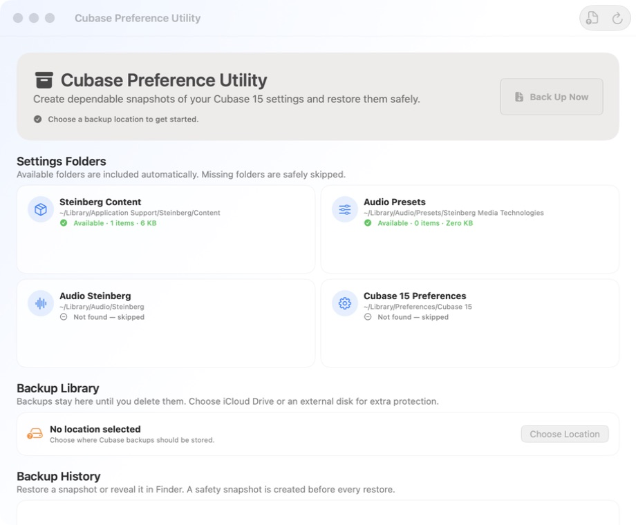

# Cubase Preference Utility

Cubase Preference Utility is a native macOS app for creating and restoring portable snapshots of Cubase 15 settings. It is designed around a simple rule: Cubase must be closed, every backup must validate before it is kept, and every restore must create a safety backup first.



## Features

- One-click backups to a folder you choose, including iCloud Drive and external disks.
- A dated `.cubasebackup` history with Restore, Reveal, and Delete actions.
- Manifest validation, ZIP checksum verification, unsafe-path rejection, and rollback after a failed restore.
- Automatic pre-restore safety backups.
- Native macOS 26 interface with keyboard and VoiceOver support.
- No telemetry, analytics, cloud service, or background network access.

## Settings covered

Paths are resolved below the current user’s home folder; no username is hard-coded.

| Name | Home-relative path |
| --- | --- |
| Steinberg Content | `Library/Application Support/Steinberg/Content` |
| Audio Presets | `Library/Audio/Presets/Steinberg Media Technologies` |
| Audio Steinberg | `Library/Audio/Steinberg` |
| Cubase 15 Preferences | `Library/Preferences/Cubase 15` |

Missing folders are recorded in the manifest and skipped. Restoring a snapshot replaces only folders that were present in that snapshot; it does not remove a newer folder that was absent from the backup.

## Install

1. Open the latest [GitHub Release](https://github.com/mlavio829/Cubase-Preference-Utility/releases/latest).
2. Download the notarized DMG.
3. Drag **Cubase Preference Utility** into Applications.
4. Launch the app and choose a backup-library folder.

Always quit Cubase before a backup or restore. The app blocks the operation when a running Cubase process is detected.

## Build from source

Requirements:

- macOS 26 or later.
- Xcode 26.6 or later.

Clone the repository, open `Cubase Preference Utility.xcodeproj`, allow Swift Package Manager to resolve ZIPFoundation, and run the **Cubase Preference Utility** scheme. Public source builds do not require Michael’s Apple development team. Xcode can use ad-hoc signing for local development.

Command-line verification:

```sh
xcodebuild -project "Cubase Preference Utility.xcodeproj" \
  -scheme "Cubase Preference Utility" \
  -destination "platform=macOS" test
```

## Backup format

`.cubasebackup` files are ZIP-compatible archives containing:

```text
manifest.json
payload/
  steinbergContent/
  audioPresets/
  audioSteinberg/
  cubasePreferences/
```

Manifest schema version 1 carries the `com.lavicon.cubase-backup` format identifier and records the app, macOS, and Cubase versions; creation date; backup kind; and presence, count, size, and home-relative destination for each source. Absolute destinations are never stored. The restore engine rejects foreign or unknown sources, absolute paths, parent traversal, malformed manifests, uncontained symbolic links, and bad ZIP checksums.

## Privacy and security

All settings and backups remain on the Mac or storage location selected by the user. The app performs no telemetry, analytics, account login, network backup, or automatic updating. **Check for Updates** opens GitHub Releases in the default browser.

Please report vulnerabilities privately using [GitHub Security Advisories](https://github.com/mlavio829/Cubase-Preference-Utility/security/advisories/new), not a public issue.

## Contributing and license

Contributions are welcome; see [CONTRIBUTING.md](CONTRIBUTING.md). The project is released under the [MIT License](LICENSE), with third-party acknowledgements in [THIRD_PARTY_NOTICES.md](THIRD_PARTY_NOTICES.md).

Cubase and Steinberg are trademarks of Steinberg Media Technologies GmbH. This independent project is not affiliated with, endorsed by, or sponsored by Steinberg Media Technologies GmbH.
